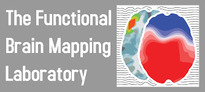

<!-- ALL-CONTRIBUTORS-BADGE:START - Do not remove or modify this section -->

<!-- ALL-CONTRIBUTORS-BADGE:END -->
# Pycrostates
---

An open-source Python package for analyzing EEG microstates developed to work with [MNE-python](https://mne.tools/stable/index.html).

## Documentation

The documentation including tutorials and exemple can be found [here](https://pycrostates.readthedocs.io/en/master).

## Installation

Installation instructions can be found [here](https://pycrostates.readthedocs.io/en/master/install.html).

---

    
    

## Contributors ✨

Thanks goes to these wonderful people ([emoji key](https://allcontributors.org/docs/en/emoji-key)):

<!-- ALL-CONTRIBUTORS-LIST:START - Do not remove or modify this section -->
<!-- prettier-ignore-start -->
<!-- markdownlint-disable -->
<table>
  <tr>
    <td align="center"><a href="https://vferat.github.io/about/"> <b>Victor Férat</b></a> <a href="https://github.com/vferat/pycrostates/commits?author=vferat" title="Tests">⚠️</a> <a href="https://github.com/vferat/pycrostates/commits?author=vferat" title="Code">💻</a></td>
  </tr>
</table>

<!-- markdownlint-restore -->
<!-- prettier-ignore-end -->

<!-- ALL-CONTRIBUTORS-LIST:END -->

This project follows the [all-contributors](https://github.com/all-contributors/all-contributors) specification. Contributions of any kind welcome!
